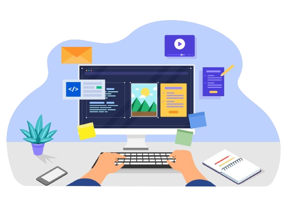
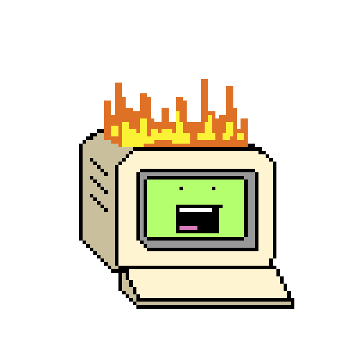

  
  <!-- -->

  

<picture></picture>

### <picture></picture> I’m currently learning...

- Full Stack Development;
- Design Patterns;
- Restful API's;
- SaaS;

  

<picture></picture>

### <picture></picture> I’m currently working on...

- SaaS para ONGs
  - [Backend](https://github.com/AlarconVinicius/sistema-de-gestao-para-ong-de-animais) | [Frontend](https://github.com/AlarconVinicius/sistema-de-gestao-para-ong-de-animais-front)

  

### <picture></picture> My Stacks

  
### <picture></picture> Contact me!

